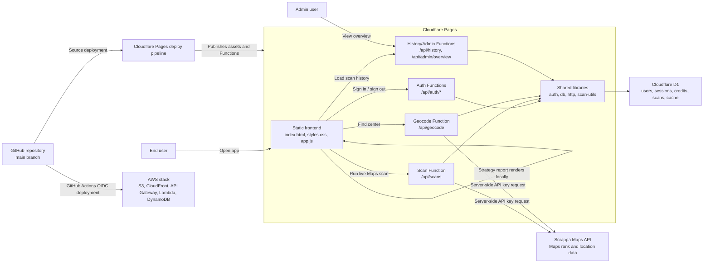

# Architecture

## Overview

Local SEO Ranker has two deployment targets. The current production path runs on Cloudflare Pages with Pages Functions and Cloudflare D1. The AWS path runs the same product surface on S3, CloudFront, API Gateway, Lambda, and DynamoDB. The frontend can generate strategy reports in the browser. Live Maps scans, geocoding, auth, credits, scan history, caching, rate limits, and admin metrics run through server-side APIs so provider credentials and account state never move into browser code.

## C4-Style Container Diagram

## Runtime Flow

1. The user opens the Cloudflare Pages site.
2. The frontend checks `/api/auth/me` for an existing HTTP-only session.
3. The user can generate a strategy report locally without provider calls.
4. For live work, the user signs in through `/api/auth/login`.
5. The backend creates or resumes a D1 user, organization, membership, subscription, and session.
6. The user can call `/api/geocode` to find center coordinates; the backend checks auth, rate limits, cache, credits, and then calls the Maps provider if needed.
7. The user calls `/api/scans` for a live Maps scan; the backend checks auth, live-scan flag, provider key, grid cap, coordinates, rate limits, cache, and credit balance.
8. The scan Function generates a coordinate grid, calls the provider with bounded concurrency, matches returned businesses, stores scan/cache records, and returns a normalized `territory` object.
9. The frontend renders the local ranking view and report sections, then refreshes account credits and scan history.
10. Admin users can load `/api/admin/overview` for account, workspace, scan, subscription, and usage totals.

## Deployment Shape

- Source: GitHub repository, production branch `main`.
- Hosting: Cloudflare Pages.
- Build command: none.
- Output directory: `.`.
- Server runtime: Cloudflare Pages Functions under `functions/`.
- Database: Cloudflare D1 binding named `DB`.
- Live app: [https://local-seo-ranker.pages.dev](https://local-seo-ranker.pages.dev).
- AWS alternative: GitHub Actions OIDC deploys `infra/aws/app.yml`, `aws/lambda/handler.mjs`, and static assets to S3/CloudFront/API Gateway/Lambda/DynamoDB.

## Key Constraints

- Provider API keys must never be exposed to browser code.
- Live scans require an authenticated account and available credits.
- Live scans require `ENABLE_LIVE_SCANS=true`; a provider key alone is not enough.
- The default live-scan cap is 81 grid points.
- Duplicate live scans can use a one-day workspace cache.
- Geocode lookups use a 30-day workspace cache.
- API responses are marked `no-store`.
- CORS is limited to the request origin and optional configured origins.
- The first account can bootstrap admin access only while the user table is empty and no invite code is configured.

## Extension Points

- Stripe subscription and plan lifecycle integration.
- Passwordless email login and team invitations.
- Scheduled recurring scans and trend charts.
- Provider adapter interface for SerpBase and DataForSEO.
- Manual QA workflow to compare provider ranks against observed Google Maps checks.
