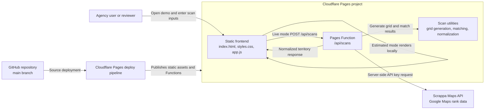

# Architecture

## Overview

Local SEO Ranker is a static Cloudflare Pages application with a small server-side scan boundary implemented as Cloudflare Pages Functions. The frontend can generate deterministic estimated reports entirely in the browser. When live mode is enabled, the browser sends scan inputs to `/api/scans`, where the backend validates cost controls, generates a coordinate grid, calls Scrappa Maps Advanced Search, normalizes the provider response, and returns the same `territory` shape used by demo reports.

The system is intentionally lightweight: there is no database, account system, queue, or saved-report layer yet. That keeps the demo fast and reviewable while leaving clear extension points for persistence, caching, billing, and additional rank providers.

## C4-Style Container Diagram

## Runtime Flow

1. The user opens the Cloudflare Pages site.
2. The frontend reads form inputs for business, website, keyword, city, state, competitors, optional Maps URL, grid size, and center coordinates.
3. In estimate mode, `app.js` generates a deterministic report and local rank grid without network provider calls.
4. In live mode, the frontend posts the same scan inputs to `/api/scans`.
5. The Pages Function validates required fields, `ENABLE_LIVE_SCANS`, `SCRAPPA_API_KEY`, grid size, and center coordinates.
6. The backend generates the coordinate grid with `functions/_lib/scan-utils.js`.
7. The backend calls Scrappa once per grid point with bounded concurrency.
8. Provider results are matched against the target business by Maps identifier, domain, and normalized business name.
9. The Function returns a normalized `territory` object to the browser.
10. The frontend renders the report and enables copy, JSON, CSV, and print exports.

## Deployment Shape

- Source: GitHub repository, production branch `main`.
- Hosting: Cloudflare Pages.
- Build command: none.
- Output directory: `.`.
- Server runtime: Cloudflare Pages Functions under `functions/`.
- Live demo: [https://local-seo-ranker.pages.dev](https://local-seo-ranker.pages.dev).

## Key Constraints

- No provider API keys can be exposed to the browser.
- Live scans require `ENABLE_LIVE_SCANS=true`; a Scrappa key alone is not enough.
- The default live-scan cap is 81 grid points.
- API responses are marked `no-store`.
- CORS is limited to the request origin and optional configured origins.
- The app currently has no persistence, auth, billing, queue, or historical scan storage.
- Demo mode must remain clearly labeled as an estimate.

## Extension Points

- Add persistence and duplicate-request caching behind `/api/scans`.
- Add user auth and per-account scan credits before public self-serve use.
- Add geocoding so users can enter an address instead of latitude and longitude.
- Add provider adapters for SerpBase or DataForSEO using the same normalized `territory` model.
- Add scheduled scans and report history after persistence exists.
